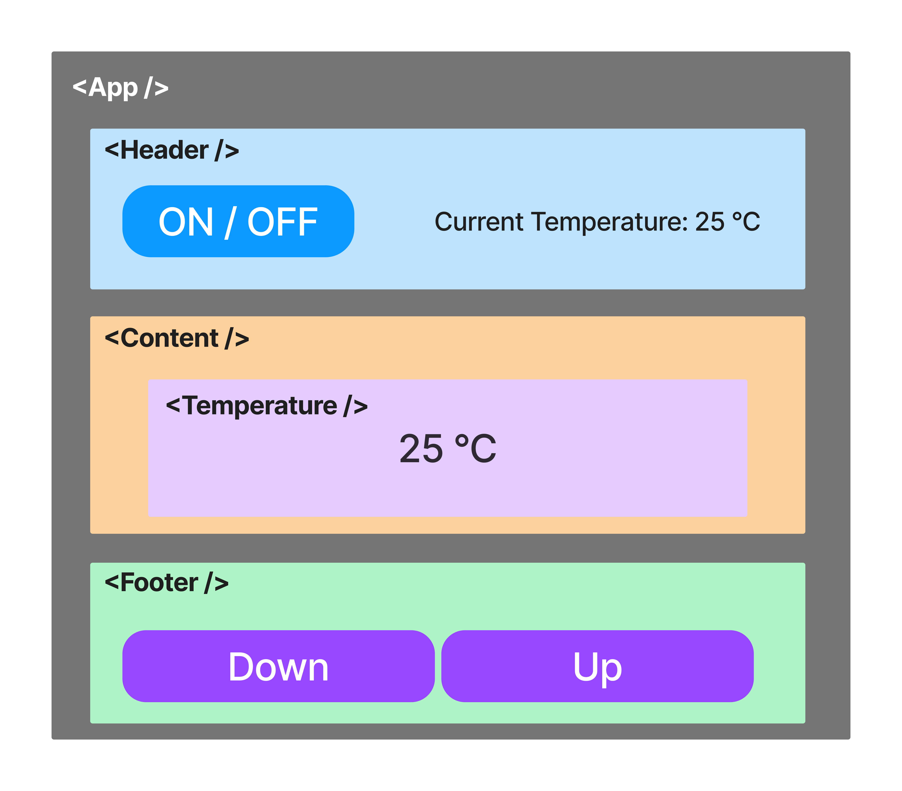

# React Exercise 03

## Pass "temperature" to components that you've hard coded in Exercise 02



- Header
- Content contains Temparature
- Footer

```
in <App /> contains:
<Header />
<Content />
<Footer />
```
